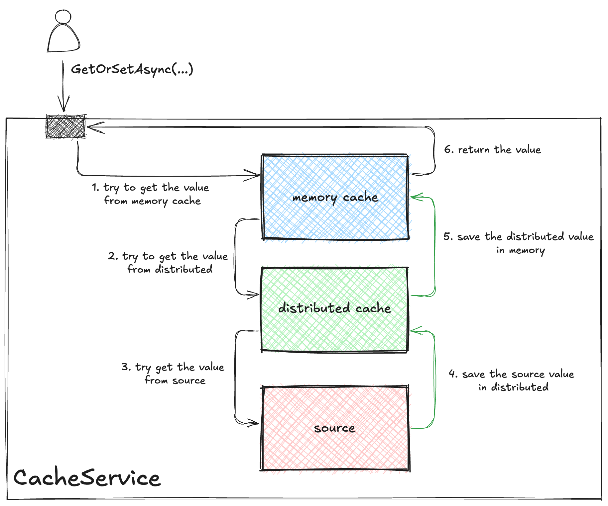

[](../../LICENSE)
[](https://www.nuget.org/packages/CacheService)


# CacheService

CacheService is a simple and fast double layer cache service for dotnet core. It uses `IMemoryCache` and `IDistributedCache` to store the cache values and has a background process to automatically refresh the cache values at a specified time interval.

## Table of Contents

- [CacheService](#cacheservice)
  - [Table of Contents](#table-of-contents)
  - [Features](#features)
  - [Quick Start](#quick-start)
  - [Background update](#background-update)
  - [ICacheService](#icacheservice)
    - [CacheServiceOptions](#cacheserviceoptions)
    - [CacheOptions](#cacheoptions)
  - [Configuration](#configuration)
  - [Performance vs. HybridCache](#performance-vs-hybridcache)
    - [Benchmark results](#benchmark-results)
  - [License](#license)

## Features

The main idea is to have an in-memory cache and a distributed cache, both managed by a single service: `ICacheService`.

This service have the `GetOrSetAsync()` method and it should:
1. Read from MemoryCache (if it exists return the read value)
2. Read from DistributedCache (if it exists return the read value) and then set it in MemoryCache
3. Read from source (if it doesn't exist return `null`) and then set in MemoryCache and DistributedCache.



And all values read from any source or cache should be automatically refreshed in the background at a specified time:

## Quick Start

Before using this library, you need to install the NuGet package:

```bash
dotnet add package CacheService
```

CacheService has some dependencies that should be already registered in your application: `ILoggerFactory`, `IMemoryCache` and `IDistributed`. As an example:

```csharp
using Microsoft.Extensions.Logging;
using Microsoft.Extensions.Caching.Memory;
using Microsoft.Extensions.Caching.StackExchangeRedis;

// dependencies
services.AddLogging();
services.AddMemoryCache();
services.AddStackExchangeRedisCache(op => ...);
```

Next, to use the CacheService you need to add the following line in the startup file:

```csharp
// register cache service
services.AddCacheService();
```

Finally you can use the `ICacheService` in your methods getting the cache from the `ServiceProvider`:

```csharp
var cache = serviceProvider.GetRequiredService<ICacheService>();
var myCachedValue = cache.GetOrSetAsync("some-key", ct => GetValueFromDatabaseAsync(ct), cancellationToken);
```

Or in any Asp.Net Core MVC controller:

```csharp
public WeatherForecastController(ICacheService cache)
{
    _cache = cache;
}

[HttpGet(Name = "GetWeatherForecast")]
public async Task<IActionResult> GetAsync()
{
    var model = await _cache.GetOrSetAsync("forecast", ct => GetFromDatabaseAsync(ct), HttpContext.RequestAborted);
    return Ok(model);
}
```

## Background update

The `CacheService` has a background process that automatically refreshes the cache value at a specified time. This feature has some important points:

- When a user configures the `RefreshInterval` in the `CacheOptions` the cache value will be automatically refreshed at the specified time.
- The `RefreshInterval` can be configured specifically for each request or globally in the `CacheServiceOptions`.
- To make the background process work, you need to configure the `BackgroundJobMode` in the `CacheServiceOptions`. The options are `None`, `HostedService` or `Timer`.

Example of a global configuration:

```csharp
services.AddCacheService(op =>
{
    op.DefaultOptions = new CacheServiceOptions
    {
        Memory = new CacheOptions
        {
            RefreshInterval = TimeSpan.FromMinutes(10)
        },
        Distributed = new CacheOptions
        {
            RefreshInterval = TimeSpan.FromMinutes(10)
        },
        BackgroundJobMode = BackgroundJobMode.HostedService,
        BackgroundJobInterval = TimeSpan.FromMinutes(1)
    };
});
```

Example of a specific configuration:

```csharp
var cache = serviceProvider.GetRequiredService<ICacheService>();
var options = new CacheServiceOptions();
options.Memory.RefreshInterval = TimeSpan.FromMinutes(5);
options.Distributed.RefreshInterval = TimeSpan.FromMinutes(30);

var myCachedValue = cache.GetOrSetAsync("some-key", options, ct => GetValueFromDatabaseAsync(ct), cancellationToken);
```

There are two ways to use the background process: `HostedService` and `Timer`.

If you use the `HostedService` mode, the background process will be executed as a hosted service in the application. This way, the cache value will be automatically refreshed at the specified time.

But if your application does not support hosted services, you can use the `Timer` mode. In this mode, the background process will be executed as a timer in the application. The `Timer` is started when the first cache value is set.


By default, the `BackgroundJobMode` is set to `HostedService` and the `BackgroundJobInterval` is set to `TimeSpan.FromMinutes(1)`. But there is not a default value for the `RefreshInterval` in the `CacheOptions`, so if you want to use the background process you need to set the `RefreshInterval` in the `CacheOptions`.


## ICacheService

The main `ICacheService` method is `GetOrSetAsync`. It allows you to get a value from the cache or set a new value in the cache:

```csharp
ValueTask<T> GetOrSetAsync<T>(string key, CacheServiceOptions options, Func<CancellationToken, ValueTask<T>> getter, CancellationToken cancellationToken = default);
```

The parameters are:
| Parameter | Mandatory | Description | Type |
| --------- | ---------- | ----------- | ---- |
| key | Yes | The cache key | `string` |
| options | No | The `CacheServiceOptions` to use | `CacheServiceOptions` |
| getter | Yes | The function to get the value from the source | `Func<CancellationToken, ValueTask<T>>` |
| cancellationToken | No | The cancellation token | `CancellationToken` |

### CacheServiceOptions

`CacheServiceOptions` is a class that contains the options to use in the `ICacheService` methods. It has the following properties:

| Property | Description | Type |
| -------- | ----------- | ---- |
| Memory | Sets the configuration for the in memory cache | `CacheOptions` |
| Distributed | Sets the configuration for the distributed cache | `CacheOptions` |
| ForceRefresh | Sets if you want to force the refresh of the cache value | `bool` |

### CacheOptions

`CacheOptions` is a class that contains the options to use in each configured kind of cache. It has the following properties:

| Property | Description | Type | Default |
| -------- | ----------- | ---- | ------- |
| AbsoluteExpiration | Sets an absolute expiration date for the cache entry | `DateTimeOffset` | `null` |
| AbsoluteExpirationRelativeToNow | Sets an absolute expiration date relative to now for the cache entry | `TimeSpan` | `null` |
| SlidingExpiration | sets how long a cache entry can be inactive (e.g. not accessed) before it will be removed. This will not extend the entry lifetime beyond the absolute expiration (if set) | `TimeSpan` | `null` |
| RefreshInterval | Sets the interval to automatically refresh the cache value | `TimeSpan` | `null` |


## Configuration

You can add the cache service to the `services` collection:

```csharp
services.AddCacheService(op => ...);
```

And you can configure the `ICacheService` with the following options:

| Property | Description | Type | Default |
| -------- | ----------- | ---- | ------- |
| DefaultOptions | Sets the default options to use in the `ICacheService` methods | `CacheServiceOptions` | |
| UseMemoryCache | Sets if you want to manage `IMemoryCache` with `ICacheService` | `bool` | `true` |
| UseDistributedCache | Sets if you want to manage `IDistributedCache` with `ICacheService` | `bool` | `true` |
| BackgroundJobMode | Sets how you want to use the background process to automatically update your cache values<br/>*Options are: `None`, `HostedService` or `Timer`* | `BackgroundJobMode` | `BackgroundJobMode.HostedService` |
| BackgroundJobInterval | Sets the background process to update cache value execution interval | `TimeSpan` | `TimeSpan.FromMinutes(1)` |

## Performance vs. HybridCache

The `HybridCache` is a similar library from Microsoft that has a similar goal. The main difference is that `HybridCache` uses a "stampede protection" mechanism to avoid multiple requests to the source when the cache expires. This mechanism is based on a distributed lock that is acquired by the first request that detects that the cache has expired.

The `CacheService` does not have this mechanism, but it has a background process that automatically refreshes the cache value at a specified time. This way, the cache value is always updated and the stampede protection is not necessary.


### Benchmark results

You can see the benchmark project in the `benchmarks/CacheService.Benchmark` folder.

The latest results are:

**Microsoft.Extensions.Caching.Hybrid v9.0.0-preview.9.24556.5**
**.NET SDK 9.0.100**

*Apple M3 Max, 1 CPU, 14 logical and 14 physical cores*
| Method       | ConcurrentCalls | Mean       | Error     | StdDev    | Ratio | RatioSD | Gen0     | Gen1     | Allocated  | Alloc Ratio |
|------------- |---------------- |-----------:|----------:|----------:|------:|--------:|---------:|---------:|-----------:|------------:|
| CacheService | 1               |   184.0 us |   3.13 us |   2.44 us |  1.00 |    0.02 |   1.9531 |   0.4883 |   15.83 KB |        1.00 |
| HybridCache  | 1               |   194.5 us |   3.86 us |   5.78 us |  1.06 |    0.03 |   3.9063 |   0.9766 |   24.58 KB |        1.55 |
| CacheService | 10              |   553.0 us |  10.96 us |  17.06 us |  1.00 |    0.04 |  19.5313 |   5.8594 |  156.99 KB |        1.00 |
| HybridCache  | 10              |   562.0 us |   9.93 us |   9.28 us |  1.02 |    0.04 |  37.1094 |   9.7656 |   245.1 KB |        1.56 |
| CacheService | 100             | 3,361.4 us |  63.93 us |  78.51 us |  1.00 |    0.03 | 199.2188 |  78.1250 | 1567.58 KB |        1.00 |
| HybridCache  | 100             | 3,531.9 us |  86.35 us | 172.46 us |  1.05 |    0.06 | 359.3750 |  85.9375 | 2448.26 KB |        1.56 |
| CacheService | 200             | 6,168.5 us | 120.16 us | 106.52 us |  1.00 |    0.02 | 390.6250 | 171.8750 | 3134.53 KB |        1.00 |
| HybridCache  | 200             | 6,590.8 us | 128.88 us | 143.25 us |  1.07 |    0.03 | 726.5625 | 203.1250 | 4895.26 KB |        1.56 |

*Intel Core i7-9750H CPU 2.60GHz, 1 CPU, 12 logical and 6 physical cores*
| Method       | ConcurrentCalls | Mean      | Error     | StdDev    | Ratio | RatioSD | Gen0     | Gen1     | Allocated  | Alloc Ratio |
|------------- |---------------- |----------:|----------:|----------:|------:|--------:|---------:|---------:|-----------:|------------:|
| CacheService | 1               |  1.038 ms | 0.0200 ms | 0.0222 ms |  1.00 |    0.03 |   1.9531 |        - |   15.82 KB |        1.00 |
| HybridCache  | 1               |  1.071 ms | 0.0210 ms | 0.0225 ms |  1.03 |    0.03 |   3.9063 |   1.9531 |   24.57 KB |        1.55 |
| CacheService | 10              |  1.429 ms | 0.0310 ms | 0.0619 ms |  1.00 |    0.06 |  23.4375 |   7.8125 |  156.56 KB |        1.00 |
| HybridCache  | 10              |  1.495 ms | 0.0383 ms | 0.0747 ms |  1.05 |    0.07 |  46.8750 |  11.7188 |  244.73 KB |        1.56 |
| CacheService | 100             |  5.718 ms | 0.1479 ms | 0.2885 ms |  1.00 |    0.07 | 250.0000 |  93.7500 | 1563.96 KB |        1.00 |
| HybridCache  | 100             |  6.073 ms | 0.1571 ms | 0.3138 ms |  1.06 |    0.08 | 437.5000 | 125.0000 | 2445.72 KB |        1.56 |
| CacheService | 200             | 10.890 ms | 0.1673 ms | 0.1927 ms |  1.00 |    0.02 | 531.2500 | 171.8750 | 3127.65 KB |        1.00 |
| HybridCache  | 200             | 12.408 ms | 0.3590 ms | 0.7002 ms |  1.14 |    0.07 | 765.6250 | 437.5000 | 4096.64 KB |        1.31 |

As you can see, the `CacheService` is faster than the `HybridCache` in all scenarios but the difference is not significant. Related to memory usage, the `CacheService` is more efficient than the `HybridCache` because it does not need to use a distributed lock to avoid the stampede effect.

## License

The source code we develop at CacheService is by default being licensed as MIT. You can read more about [here](LICENSE).