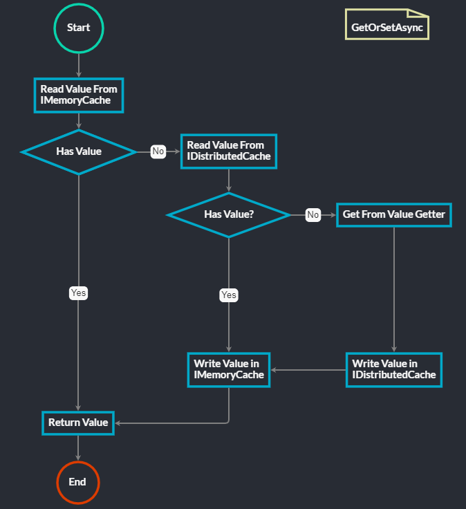

# CacheService

CacheService is a simple and fast double layer cache service for dotnet core.

## Features

The main idea is to have an in memory cache and a distributed cache, both managed by a single service: `ICacheService`.

This service have the `GetOrSetAsync()` method and it should:
1. Read from MemoryCache (if exists return the read value)
2. Read from DistributedCache (if exists return the read value) and then set it in MemoryCache
3. Read from source (if not exists return `null`) and then set in MemoryCache and DistributedCache.

And all values read from any source or cache should be automatically refreshed in the background at a specified time.



## Quick Start

Before using this library, you need to install the NuGet package:

```bash
dotnet add package CacheService
```

CacheService has some dependencies should be already registered in your application: `ILoggerFactory`, `IMemoryCache` and `IDistributed`. As an example:

```csharp
using Microsoft.Extensions.Logging;
using Microsoft.Extensions.Caching.Memory;
using Microsoft.Extensions.Caching.StackExchangeRedis;

// dependencies
services.AddLogging();
services.AddMemoryCache();
services.AddStackExchangeRedisCache(op => ...);
```

Next, to use the CacheService you need to add the following line in the startup file:

```csharp
// register cache service
services.AddCacheService();
```

Finally you can use the `ICacheService` in your methods getting the cache from the `ServiceProvider`:

```csharp
var cache = serviceProvider.GetRequiredService<ICacheService>();
var myCachedValue = cache.GetOrSetAsync("some-key", ct => GetValueFromDatabaseAsync(ct), cancellationToken);
```

Or in any Asp.Net Core MVC controller:

```csharp
public WeatherForecastController(ICacheService cache)
{
    _cache = cache;
}

[HttpGet(Name = "GetWeatherForecast")]
public async Task<IActionResult> GetAsync()
{
    var model = await _cache.GetOrSetAsync("forecast", ct => GetFromDatabaseAsync(ct), HttpContext.RequestAborted);
    return Ok(model);
}
```

## ICacheService

The main `ICacheService` method is `GetOrSetAsync`. It allows you to get a value from the cache or set a new value in the cache:

```csharp
ValueTask<T> GetOrSetAsync<T>(string key, CacheServiceOptions options, Func<CancellationToken, ValueTask<T>> getter, CancellationToken cancellationToken = default);
```

The parameters are:
| Parameter | Mandatory | Description | Type |
| --------- | ---------- | ----------- | ---- |
| key | Yes | The cache key | `string` |
| options | No | The `CacheServiceOptions` to use | `CacheServiceOptions` |
| getter | Yes | The function to get the value from the source | `Func<CancellationToken, ValueTask<T>>` |
| cancellationToken | No | The cancellation token | `CancellationToken` |

### CacheServiceOptions

`CacheServiceOptions` is a class that contains the options to use in the `ICacheService` methods. It has the following properties:

| Property | Description | Type |
| -------- | ----------- | ---- |
| Memory | Sets the configuration for the in memory cache | `CacheOptions` |
| Distributed | Sets the configuration for the distributed cache | `CacheOptions` |
| ForceRefresh | Sets if you want to force the refresh of the cache value | `bool` |

### CacheOptions

`CacheOptions` is a class that contains the options to use in each configured kind of cache. It has the following properties:

| Property | Description | Type | Default |
| -------- | ----------- | ---- | ------- |
| AbsoluteExpiration | Sets an absolute expiration date for the cache entry | `DateTimeOffset` | `null` |
| AbsoluteExpirationRelativeToNow | Sets an absolute expiration date relative to now for the cache entry | `TimeSpan` | `null` |
| SlidingExpiration | sets how long a cache entry can be inactive (e.g. not accessed) before it will be removed. This will not extend the entry lifetime beyond the absolute expiration (if set) | `TimeSpan` | `null` |
| RefreshInterval | Sets the interval to automatically refresh the cache value | `TimeSpan` | `null` |


## Configuration

You can add the cache service to the `services` collection:

```csharp
services.AddCacheService(op => ...);
```

And you can configure the `ICacheService` with the following options:

| Property | Description | Type | Default |
| -------- | ----------- | ---- | ------- |
| DefaultOptions | Sets the default options to use in the `ICacheService` methods | `CacheServiceOptions` | |
| UseMemoryCache | Sets if you want to manage `IMemoryCache` with `ICacheService` | `bool` | `true` |
| UseDistributedCache | Sets if you want to manage `IDistributedCache` with `ICacheService` | `bool` | `true` |
| BackgroundJobMode | Sets how you want to use the background process to automatically update your cache values<br/>*Options are: `None`, `HostedService` or `Timer`* | `BackgroundJobMode` | `BackgroundJobMode.HostedService` |
| BackgroundJobInterval | Sets the background process to update cache value execution interval | `TimeSpan` | `TimeSpan.FromMinutes(1)` |

## License

The source code we develop at CacheService is default being licensed as MIT. You can read more about [here](LICENSE).